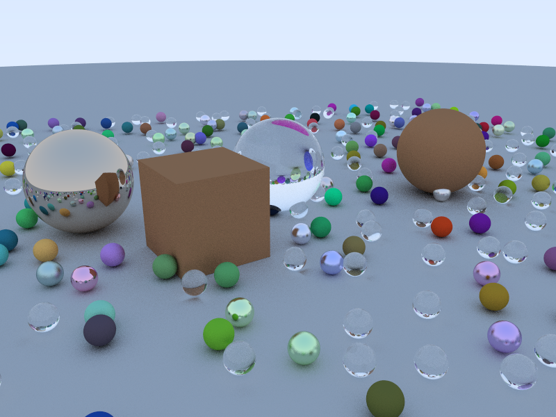

# Ray-tracing

## 1. Description

This project implement an easy ray tracer running on cpu, which is built with following third parties.

- [GLM](https://github.com/g-truc/glm) for linear algebra calculation.
- [stb_image](https://github.com/nothings/stb) for image rendering.
- [tbb](https://github.com/oneapi-src/oneTBB) for parallel acceleration.

This project refers to the following articles and the code is only used for learning. 

- [光线追踪器Ray Tracer：入门篇](https://yangwc.com/2019/05/08/RayTracer-Basis/)
- [光线追踪器Ray Tracer：进阶篇](https://yangwc.com/2019/05/23/RayTracer-Advance/)


## 2. Environment

The code is based on C++17 standard, requiring at least cmake 3.25 version.

Use the following command to pull dependence from their repositories. 

``` bash
git submodule init
git submodule update
```

## 3. Result

We sampled $100$ rays with $800 \times 600$ viewport, and the single rendering costs 240s.

