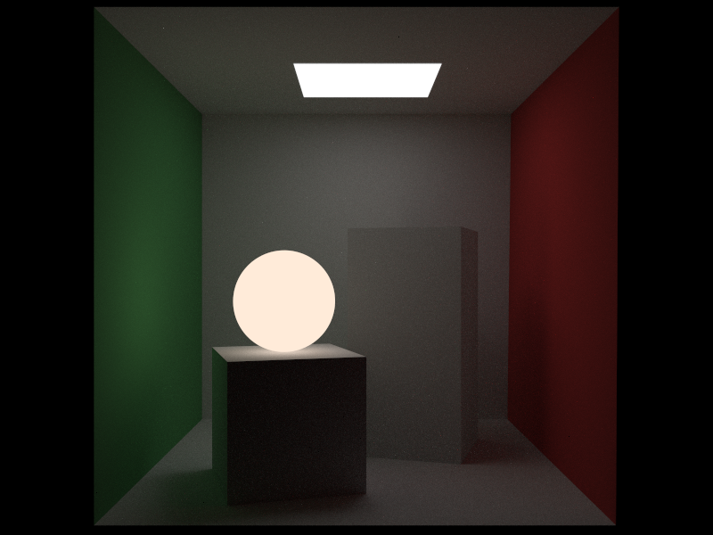
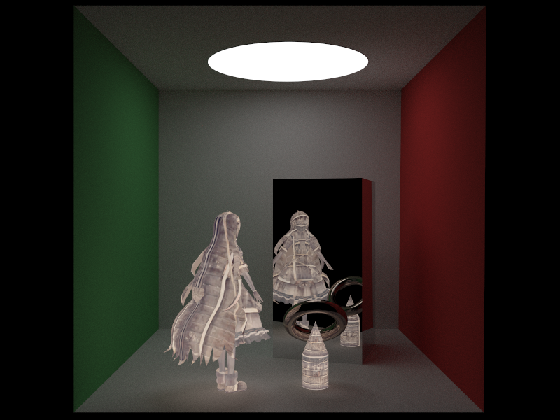

# Monte Carlo Ray Tracing

## 1. Description

This project implement an easy Monte Carlo ray tracer based on cpu, built with the following third-parties.

- [GLM](https://github.com/g-truc/glm) for linear algebra calculation.
- [stb_image](https://github.com/nothings/stb) for image rendering.
- [tbb](https://github.com/oneapi-src/oneTBB) for parallel acceleration.
- [assimp](https://github.com/assimp/assimp) for mesh processing.
- [nlohmann_json](https://github.com/nlohmann/json) for json analysis.
- [igl](https://github.com/libigl/libigl.git) for ray-mesh intersection.

The principle could refer to my blog and the code is only used for learning. 

- [Monte Carlo Ray Tracing](http://blog.leanote.com/post/chty_syq/Ray-Tracing-1)


## 2. Environment

The code is based on C++17 standard, requiring at least cmake 3.25 version.

Use the following command to pull dependence from their repositories. 

``` bash
git submodule init
git submodule update
```

## 3. Result

We sampled $100$ rays with $800 \times 600$ viewport, and the single rendering costs 20s with release build.

#### Spheres with Environment Light


#### Cornell-Box with Quad Light


#### Cornell-box with Sphere Light


#### Cornell-box with both Quad and Sphere Light


#### Cornell-box with 1000 Rays


#### Cornell-box with Isotropic Box



#### Cornell-box with Metal Box


#### Cornell-box with Graphics

